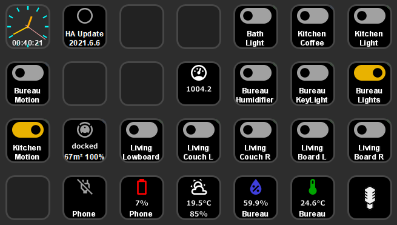
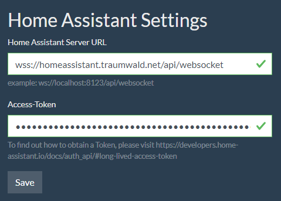
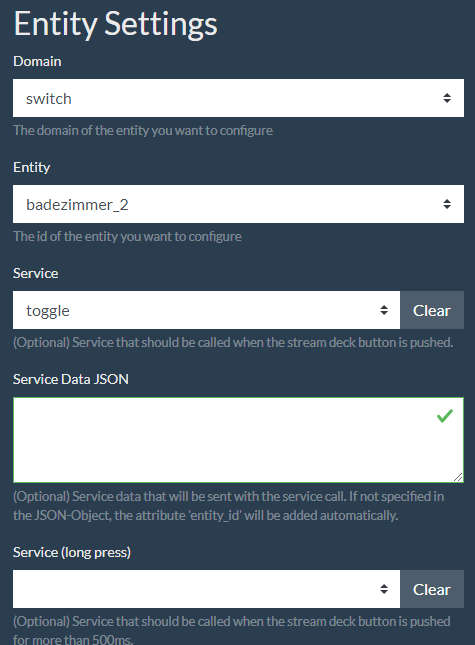
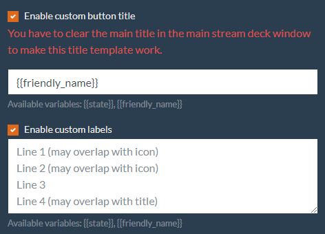

# StreamDeck Home-Assistant Plugin

The aim of this project is to allow owners of an elgato StreamDeck to control their entities or display sensor data via
their StreamDeck. As the code is very generic, nearly every sensor should work out of the box as well as every
service that does not need any more information but the entity id.



## Features

### Generic functions for any Home Assistant entity

- Display state and additional attributes via customizable templates
- Call services when a StreamDeck button is pressed (or hold for some time)

### Entities with background-icons

- Switches
- Lights (same icon as switches)
- Input Boolean (same icon as switches)
- Binary Sensors
  - Plugs
- Temperature
- Humidity
- Pressure
- Power
- Voltage
- Battery-Level
- Weather
- Vacuum robots (experimental, tested with Roborock S5)

# Installation

## Prerequisites

- Installed Stream-Deck application
- Connected Stream-Deck

## Installation

### Via the official Stream Deck store

You can find and install this plugin from the [official Stream Deck Store](https://apps.elgato.com/plugins/de.perdoctus.streamdeck.homeassistant)

### Manual installation (not recommended)

- Download the latest plugin release [here][https://github.com/cgiesche/streamdeck-homeassistant/releases]
- Open the downloaded .sdplugin file. It will be automatically installed into your Stream-Deck application
  - Note for MacOS users: [manual installation steps][https://www.reddit.com/r/homeassistant/comments/laq2g4/homeassistant_streamdeck_plugin_dynamic_not_just/glu0zep/?utm_source=share&utm_medium=web2x&context=3]

# Configuration

There are two sections on the plugin's configuration panel:

- Home Assistant Settings  
  Contains global settings for your Home Assistant installation. Once saved, the settings are used for all Stream-Deck buttons.
- Entity Settings
  Contains settings for an individual button.

## Home Assistant Settings

- Server URL: `ws://your-homeassistant-ip-or-hostname:your-homeassistant-port/api/websocket`, for example (local network) `ws://192.126.0.5:8123/api/websocket` or (public, with ssl enabled on default port 443) `wss://my-secure-homeassistant.com/api/websocket`.
- Access Token: An long-lived access-token (with admin right) obtained from your Home Assistant. The plugin requires the admin rights, because it uses "execute-script" command that is restricted to admin users.
  _Long-lived access tokens can be created using the "Long-Lived Access Tokens" section at the bottom of a user's Home Assistant profile page._ (Quote from https://developers.home-assistant.io/docs/auth_api/#long-lived-access-token)

After you save your Home Assistant Settings, the plugin will automatically try to connect to your Home Assistant installation. If the connection was successful, the Entity Settings section should allow you to see and configure your entities.



## Entity Settings

### Basic configuration

- Domain: Home Assistant entities are grouped by domains. Select the domain (for example "switch") of an entity, you want to configure.
- Entity: This is the actual entity you are going to configure (for example "Kitchen Light")
- Service: The service will be called when you press the StreamDeck button (green marker at the top right corner).
- Service (long press): The service that will be called every time you press and hold the StreamDeck button for more than 300ms (blue marker at the top right corner).
- Service Data JSON: JSON formatted data that is sent with your service call when you press a button.
  Example:
  ```
  {
    "brightness": 120,
    "rgb_color": [255, 0, 0]
  }
  ```
  If not specified in the JSON, the attribute `entity_id` is being added automatically containing the selected entity's id. You can also specify the target entity_id manually, for example to switch multiple lights at once:
  ```
  {
    "entity_id": [
      "switch.osram_plug_01_bac00b0a_on_off",
      "switch.osram_plug_01_87c00a0a_on_off"
    ],
    "brightness": 120,
    "rgb_color": [255, 0, 0]
  }
  ```
  You can also use [Jinja2 templates](https://www.home-assistant.io/docs/configuration/templating/) to dynamically process data based on the states or attributes of your Home Assistant entities. See [Using Jinja2 Templates in Service Data JSON](#Advanced-configuration) for more information.



### Advanced configuration

- **Custom Title:** Enable to override the main Title of this button. **You have to clear the main Title field on top to make this work!**

  - Title Template: A [nunjucks template](https://mozilla.github.io/nunjucks/templating.html) that will be used as the button's title. You can use any of the variables (depending on the selected entity) that are shown below the text-field. For example `{{temperature}}°C` or `{{friendly_name}}` or (this won't fit the button, but you get the idea) `The pressure is {{pressure}} and the wind speed is {{wind_speed}}.`
    - The variable `{{state}}` always contains the "main state" of an entity (for example "on" and "off" for buttons or "12.4" for temperature sensors)
  - The variable `{{unit_of_measurement}}` often contains the ... unit of measurement ... of a sensor's state (for example "°C" for a temperature sensor)

- **Custom Labels:** Every button can display up to 4 lines of information

  - Each line in the text-box represents one line on the button
  - Depending on if there is an icon or a title for the entity, you may need to leave blank lines in order to not mess up the layout :)
  - You can use [nunjucks template](https://mozilla.github.io/nunjucks/templating.html) for dynamic content (see above).

    After you hit the save button, the button should immediately show the new configuration.

    

- **Using Jinja2 Templates in Service Data JSON**

  - **Jinja2 Template Integration:** You can incorporate Jinja2 templates within the Service Data JSON to dynamically
    process data based on the states or attributes of your Home Assistant entities.
  - **Encapsulation with Raw Tags:** It's crucial to enclose Jinja2 templates within `` and ``
    tags. This encapsulation ensures that the StreamDeck plugin processes these templates as Jinja2, distinct from any
    Nunjucks templates you might use elsewhere in your configurations.
  - **Example of Jinja2 Template Usage:**

    ```json
    {
      "temperature": "{{ state_attr('climate.ff_office_heating','temperature') + 0.5 }}"
    }
    ```

# Happy? Consider donating me a coffee :)
[](https://api.gitsponsors.com/api/badge/link?p=A0Ld1lpHLUBhFhbrfhaghA2MNcqW0Vu/r3LHebjZA2w+qhP4SAzdNEP03kyu/fbgCX8ftpxf4wyqoZOvuBkJ2g==)

[](https://www.paypal.com/donate?hosted_button_id=3UKRJEJVWV9H4)

[https://www.reddit.com/r/homeassistant/comments/laq2g4/homeassistant_streamdeck_plugin_dynamic_not_just/glu0zep/?utm_source=share&utm_medium=web2x&context=3]: https://www.reddit.com/r/homeassistant/comments/laq2g4/homeassistant_streamdeck_plugin_dynamic_not_just/glu0zep/?utm_source=share&utm_medium=web2x&context=3
[ff]: https://www.reddit.com/r/homeassistant/comments/laq2g4/homeassistant_streamdeck_plugin_dynamic_not_just/glu0zep/?utm_source=share&utm_medium=web2x&context=3
[https://github.com/cgiesche/streamdeck-homeassistant/releases]: https://github.com/cgiesche/streamdeck-homeassistant/releases
